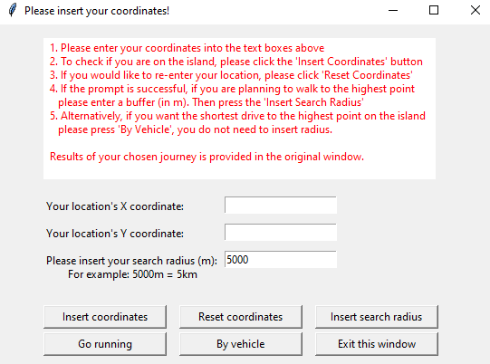
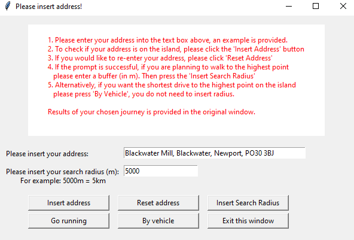
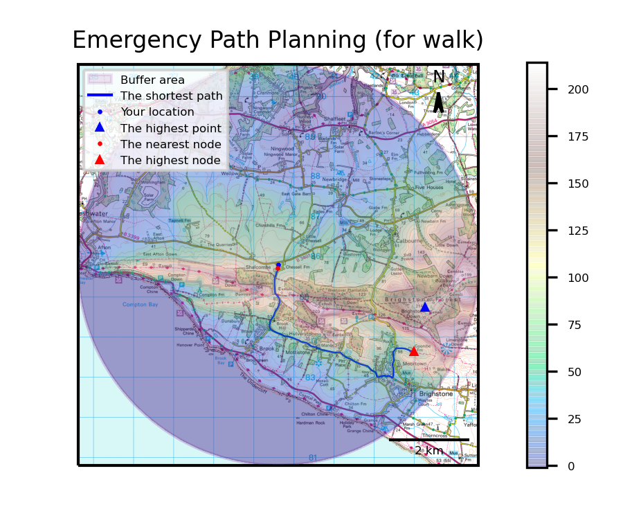
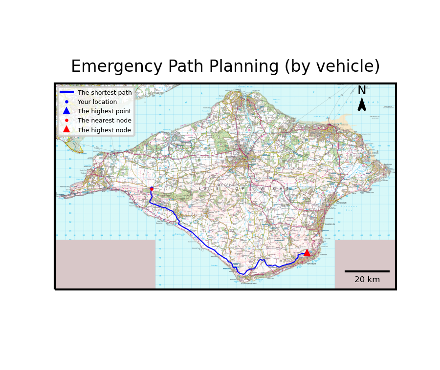

# CEGE0096_sum2
This is a repository for a Group Project between Shuling Chen, Rickie Chen and Indigo Brownhall for CEGE0096. 
The aim of the project is to build a Shortest Path Software that calcualtes a route between the user and a highest point either through walking or driving. 

Packages Required
•	Tkinter
•	Pandas
•	Networkx
•	Rasterio
•	Shapely
•	Geopandas
•	Cartopy
•	Mlp_toolkits
•	Matplotlib
•	Requests
•	Pyproj
•	OS
•	Numpy
•	Json
•	Rtree
•	CRS

How to use the software:
1.	Clone the github repository: blueriver212/CEGE0096_sum2
2.	Open CMD
3.	Locate files
4.	$ python main.py

5.	Insert each of the files needed
a.	Asc = Elevation file of the island
b.	Shape file = Shapefile of the island
c.	Json file = ITN road network
d.	Tif file = Basemap .tif file for final mapplot
6.	Important: A file explorer will pop up and ask for the user to locate the files needed. It does not have to be located in the same folder as main.py. They can be located in any folder. 
7.	Warning: The GUI was designed for a Windows Operating System. When running the program in Linux, the software design is significantly poorer. 
8.	If the user clicks ‘Insert Coordinate’

9.	Firstly enter the coordinates and the size of buffer that the user would like to search. 
10.	If the user is planning to run:
a.	Then the user must click ‘Insert search radius’
b.	For driving, the software will always take you to the highest point on the island, so the buffer size is not used. Please leave as ‘5000’.
11.	Then to check if you have entered correct coordinate format, or that you are on the island, the user must click ‘Insert coordinates’
12.	The user can also click ‘Insert Address’ on the original window

13.	This uses a Google Maps API. So the user can search anything that they would in Google. Some examples for the Isle of Wight could be:
a.	Portland Inn, 2 Worsley Rd, Cowes PO31 8JN
b.	Warren Farm, Alum Bay New Rd (You do not need to use Post Codes if not know)
c.	Bembridge Airport (Can be even simpler)
14.	Similarly to inserting coordinates, if the user is planning to ‘Go Running’ then enter a search radius. If planning to drive, just leave the input as ‘5000’.

**Output**

These are the outputs for either walking (with 5km buffer) or driving to the highest pooint on the island.

